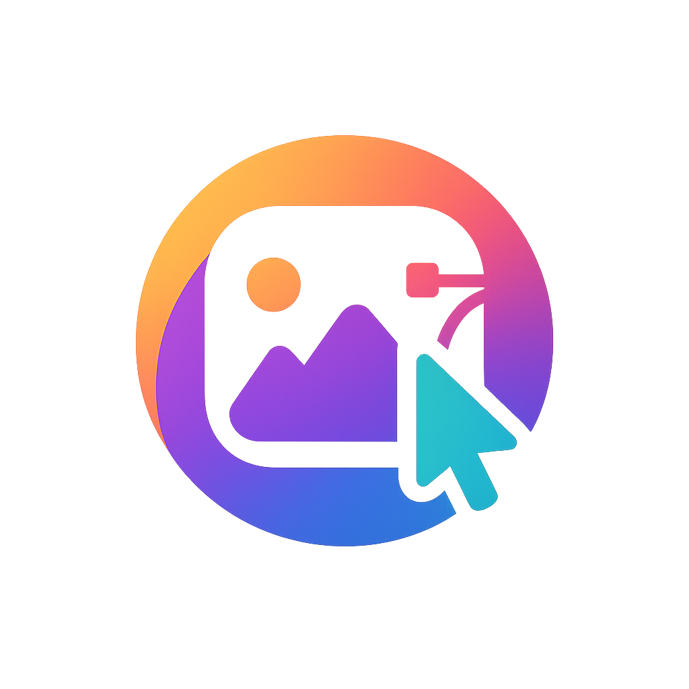
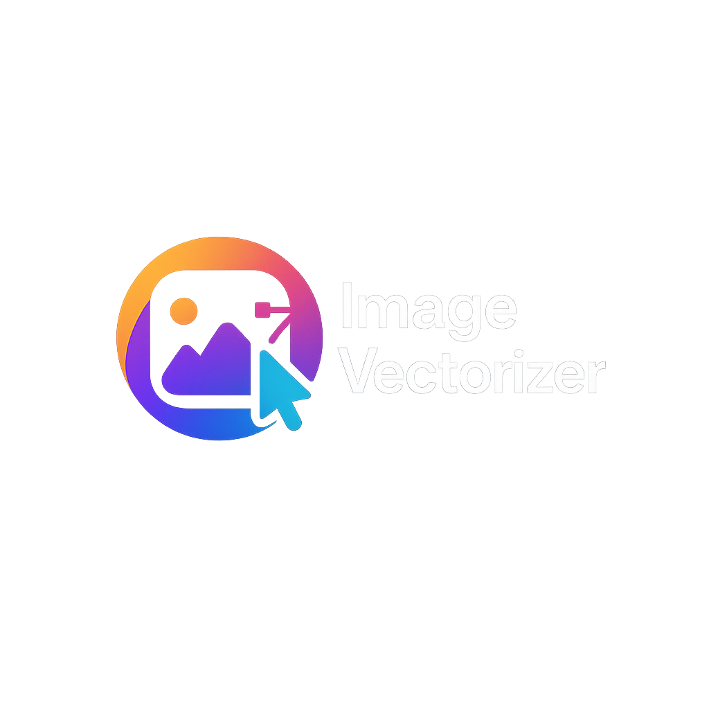
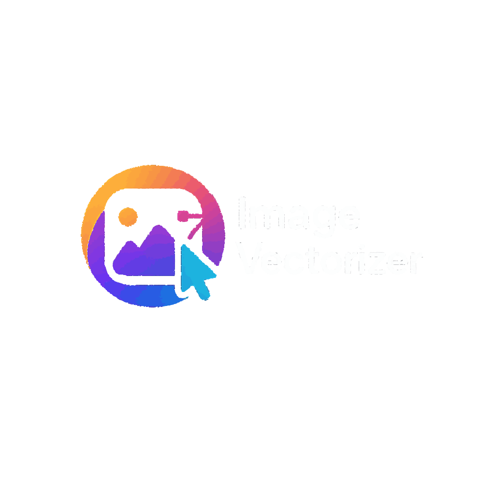

# Image to SVG Converter

A high-quality raster-to-SVG converter with Apple Silicon (M1/M2/M3/M4) support and advanced compression options.

> **Disclaimer**: This is a fun side project to explore better ways of converting images to SVGs. I found it quite challenging but learned a lot in the process. It works well on macOS with Apple Silicon (tested on M4 MacBook), but hasn't been extensively tested on other machines. This project is provided as-is for those who want to experiment and potentially improve upon it. It won't be actively maintained.

This tool converts raster images (PNG, JPG, etc.) to clean, optimized SVG vector graphics using color quantization, contour detection, and path generation. It provides both CPU and GPU acceleration support, including specific optimizations for Apple Silicon via Metal Performance Shaders.

## Examples

<div style="background-color: #333; padding: 20px; border-radius: 8px; display: inline-block; margin-bottom: 20px;">
  
  
</div>

<div style="background-color: #333; padding: 20px; border-radius: 8px; display: inline-block;">
  
  
</div>

## Features

- High-quality conversion from raster to vector graphics
- Customizable color quantization (2-256 colors)
- Advanced path simplification and optimization
- Enhanced compression with configurable precision
- Color fidelity improvements with optional enhancement
- Multi-core CPU processing for speed
- GPU acceleration support:
  - CUDA/RAPIDS acceleration for NVIDIA GPUs
  - Metal Performance Shaders (MPS) acceleration for Apple Silicon
- Outputs compressed SVGZ or uncompressed SVG
- SVG optimization with `scour`

## Installation

### Prerequisites

- Python 3.12 or higher
- [uv](https://github.com/astral-sh/uv) - Fast Python package installer and resolver

### Setting up with uv

1. Create a new virtual environment and install the package:

```bash
# Clone the repository
git clone https://github.com/yourusername/image-to-svg.git
cd image-to-svg

# Create and activate a virtual environment using uv
uv venv

# Activate the virtual environment
# On macOS/Linux:
source .venv/bin/activate
# On Windows:
# .venv\Scripts\activate

# Install required dependencies
uv pip install -e .
```

### Installing GPU Support

For Apple Silicon (M1/M2/M3/M4) GPUs:

```bash
uv pip install "torch>=2.7.0"
```

For NVIDIA GPUs:

```bash
uv pip install cupy-cuda12x cuml-cuda12x
```

Replace `cuda12x` with the appropriate CUDA version for your system.

## Usage

### Basic Usage

```bash
python image_to_svg.py input.png output.svg
```

### Options

```bash
python image_to_svg.py input.png output.svg -c 24 --gpu --enhance-colors
```

### Full Command-Line Reference

```
usage: image_to_svg.py [-h] [-c COLORS] [-e EDGE_SENSITIVITY] [-w WORKERS]
                       [-s SIMPLIFY] [-p PRECISION] [--enhance-colors]
                       [--keep-small-areas] [--no-optimize] [--gpu]
                       [--force-cpu] input output

Convert raster image to compact SVG with M-series Mac support.

positional arguments:
  input                 Input image
  output                Output .svg or .svgz file

options:
  -h, --help            show this help message and exit
  -c COLORS, --colors COLORS
                        Maximum colours (2-256)
  -e EDGE_SENSITIVITY, --edge-sensitivity EDGE_SENSITIVITY
                        Canny edge sensitivity (0.5-2.0)
  -w WORKERS, --workers WORKERS
                        Parallel workers (default = CPU count - 1)
  -s SIMPLIFY, --simplify SIMPLIFY
                        Path simplification factor (0.5-5.0, higher = simpler paths)
  -p PRECISION, --precision PRECISION
                        Decimal precision for path coordinates (0-3)
  --enhance-colors      Enhance color saturation in output
  --keep-small-areas    Keep very small areas in the output (default is to remove them)
  --no-optimize         Skip SVG optimization (faster but larger file)
  --gpu                 Use GPU acceleration (RAPIDS for NVIDIA, MPS for Apple Silicon)
  --force-cpu           Force CPU computation even on Apple Silicon
```

### Examples

#### For maximum quality:
```bash
python image_to_svg.py photo.jpg drawing.svg -c 64 -s 1.0 -p 2 --enhance-colors
```

#### For maximum compression:
```bash
python image_to_svg.py logo.png logo.svgz -c 8 -s 3.0 -p 0
```

#### Balanced approach:
```bash
python image_to_svg.py image.png result.svg -c 24 -s 1.5 -p 1
```

#### Using GPU acceleration on Apple Silicon:
```bash
python image_to_svg.py photo.jpg drawing.svg -c 32 --gpu
```

#### Creating a compressed SVGZ with enhanced colors:
```bash
python image_to_svg.py logo.png logo.svgz -c 16 --enhance-colors
```

## Managing Dependencies with uv

### Update all packages to latest versions

```bash
uv pip freeze | cut -d= -f1 | xargs uv pip install --upgrade
```

### Install a specific package

```bash
uv pip install package_name
```

### Update a single package

```bash
uv pip install --upgrade package_name
```

### Check installed packages

```bash
uv pip list
```

## Performance Tips

1. **Color count adjustment**:
   - For logos and simple graphics: 8-16 colors
   - For illustrations: 16-32 colors
   - For photos: 32-64+ colors

2. **Path simplification**:
   - Higher values (2.0-5.0) create smaller files but with less detail
   - Lower values (0.5-1.5) preserve more detail but create larger files

3. **Coordinate precision**:
   - Use 0 for minimal file size (integer coordinates)
   - Use 1 for balanced results (default)
   - Use 2-3 for highest fidelity with curved shapes

4. **Use SVGZ for large images**:
   - Output to .svgz files for additional compression
   - Especially effective for complex images

5. **GPU acceleration**:
   - Enable with `--gpu` for faster processing
   - For Apple M-series chips, ensure PyTorch ≥ 2.1.0 is installed

6. **File size optimization**:
   - Remove small areas (default) to reduce file size
   - Lower precision for smaller files
   - Use higher simplification for cleaner results with fewer nodes

## Troubleshooting

### Missing dependencies

If you see warnings about missing or outdated dependencies, update them with:

```bash
uv pip install --upgrade package_name>=version_number
```

### GPU acceleration not working

- For Apple Silicon: Ensure PyTorch ≥ 2.1.0 is installed
- For NVIDIA GPUs: Ensure RAPIDS (cuml) and CuPy are installed correctly

### Suppressing warnings

If you encounter numerical warnings during processing, they can be safely ignored as they are handled internally. To suppress them entirely, add the following environment variable:

```bash
PYTHONWARNINGS=ignore python image_to_svg.py input.png output.svg
```

### Output quality issues

- If colors look incorrect, try using `--enhance-colors`
- If the result is too simplified, decrease the simplification value with `-s 0.8`
- If the file is too large, increase simplification with `-s 2.5` and decrease precision with `-p 0`

## License

MIT

## Credits

This tool uses several open-source libraries including scikit-learn, OpenCV, NumPy, and PyTorch.